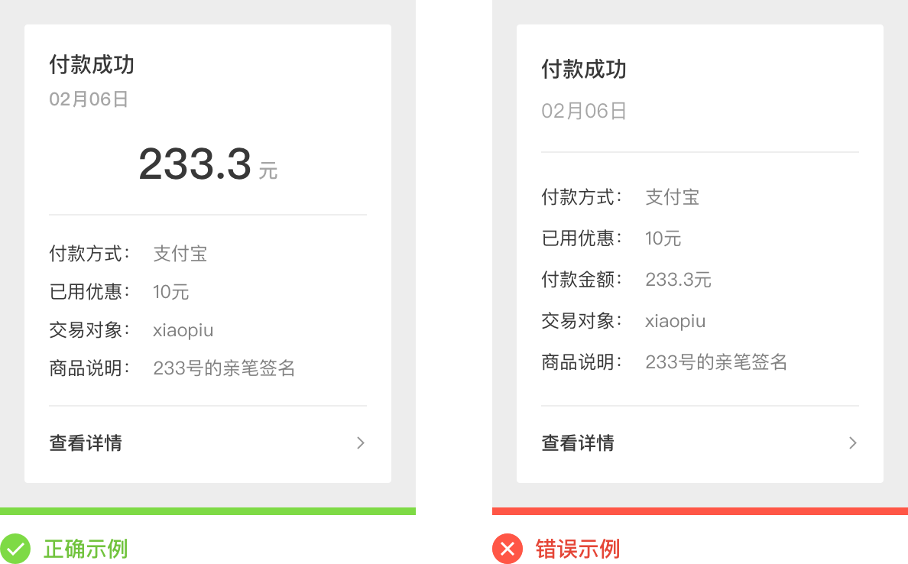
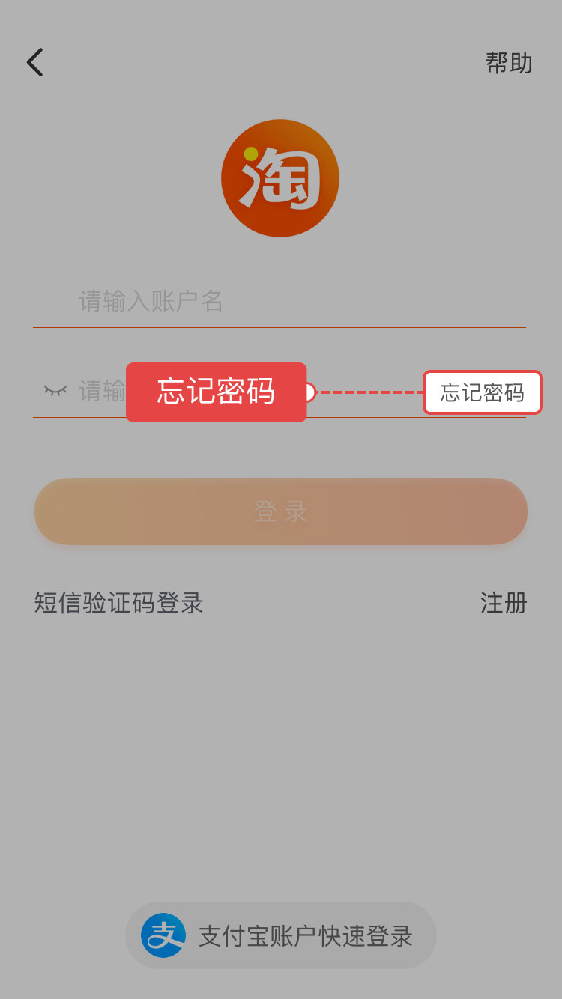

# 产品文案-语言

#### 语言

文案是我们与用户直接沟通的基础，语言文案的表述方式我们也要不断的进行推敲优化给，用户带来更好的产品体验。xiaopiu《产品文案内容-自查表》从以下几个方面对语言表述方式进行了说明：

##### 基本语言表述

- **精短简洁**

  - 表达切勿啰里啰嗦，呈现观点的同时也要突出核心

    **示例：**

    

  - 删除不必要的内容，保证文案简洁

    **示例：**

    

- **清晰准确**

  - 把事情讲清楚，千万不要有错别字

    **示例：**

    

- **有逻辑**
  
- 文案要有逻辑，层级关系要清晰明了
  
- **突出重要信息**

  - 重要的信息使用粗体等文案样式标出，并放在显眼位置，不要让用户去寻找

    **示例：**

    

- **文案统一**

  - 对同一事物的表述要一致

    **示例：**

    

  - 上下文语法、语序等要保持一致

    **示例：**

    

  - 操作名称和目标页标题名称保持一致

    **示例：**

    

- **用词要精准、完整、积极向上**

  - 用词要规范，表达要完整

    **示例：**

    

  - 若要使用专业用语，一定要精准、行业通用

  - 鼓励用户去做能给他带来“好处”的操作，在情感上用户也更愿意顺从积极的指令

    **示例：**

    

#### 内容



##### 常见说明

- **将功能具象化**

  - 文案要避免写的模糊、抽象、让人不知所云

    **示例：（华为官网）**

    

- **考虑目标用户的认知行为习惯与文化特征**

  ​    **示例：（小米官网）**

  - AI 预加载，启动不等待
  - 基于AI 深度学习，MIUI 10 预判出即将被使用的应用并提前后台预加载，一定概率实现 0 秒瞬间启动

  > **||  备注：**
  >
  > 设计产品文案时，要明确产品定位的用户人群是谁，他们行为习惯是什么样的？他们的文化理解程度怎么样？比如：小米的发烧友，文案就要充满各种前卫的技术和理念。

- **保证文案内容辨识度**

  - 获取用户喜欢的文案风格，如逗比风、卖萌风、咆哮风、优雅风（要符合产品定位）

    **示例：（bilibili 官网）**

    

- **说“人话”**

  - 切勿将文案写得”像代码语言”或者“感觉诡异”

    **示例：**

    

- 切勿将文案写得太“文艺”，让人看的云里雾里

​        **示例：（退货短信提示内容）**

​        错误示例：舍不得你离开，我含泪忍痛提醒您记得在7个工作日内将您不影响二次销售退货...

- 切勿将文案写的有歧义

  **示例：（酒店住宿）**

  

- **正确使用主动语态、动词**

  - 文案要始终以用户为主体来写

    **示例：**

    



- 为了促使用户执行操作，多用及物动词

  **示例：**

  

##### 层次性、引导性

- **要有阅读层次性**
  - 以渐进式的设计引导用户认知产品
  - 以标题文案为核心
  - 以内容解释文字为展开基础



- **“先说结论”法则**

  - 先说明操作的目的和重要性，能促使用户更愿意去执行

  **示例：**

  

- **讲清楚引导行为**

  - 表明好处，例如：折扣，优惠额度，返现等

    **示例：（当当 APP）**

  

  

  - 加入有“动作”的词，例如：抢购，发现，去，遇见等

    **示例：（洋码头 APP）**

    

  - 提出一个好问题，契合用户心中的那个“说话人”，比如常见的“忘记密码”

    **示例：（淘宝 APP）**

    

  - 提示文案进行引导

    **示例：（淘宝 APP）**

    

  - 反馈文案情感引导

    **示例：（小米官网）**

    

- **逐步展示**

  - 将提示文案分成小块，逐步展示给用户

    **示例：（bilibili 官网）**

    

- **准确的说明错误原因（表单类常见）**

  - 出现错误位置、以及出错的原因和解决问题的办法

    **示例：（淘宝 APP）**

    